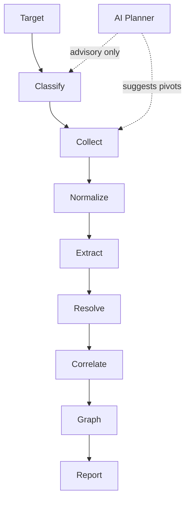

<div align="center">

# OSINT Nexus

     


**AI-Assisted, Evidence-Backed OSINT Investigation and Correlation Workstation**

A native Windows desktop application for structured open-source intelligence investigations. A single target triggers automated multi-source collection, normalization, entity extraction, relationship detection, confidence scoring, knowledge graph construction, and evidence-backed reporting -- with full source attribution at every step.

</div>

---

## How It Works

An investigation follows a deterministic pipeline. AI is advisory and never controls collection, validation, budgets, or persistence.



The AI Planner is advisory only; suggested pivots flow through deterministic validation, budgets, depth, rate limits, and dispatch controls before execution.

1. **Create or open a workspace** -- a portable `.osint` file (SQLite database).
2. **Create an investigation** -- enter a target (domain, IP, URL, email, username, or organization).
3. **Start the investigation** -- the orchestrator dispatches relevant collectors in parallel.
4. **Review findings** -- explore the interactive knowledge graph, inspect entities, view observations.
5. **Follow pivots** -- the planner may suggest additional targets based on current findings; deterministic validation, budgets, depth, and dispatch controls determine whether they are executed.
6. **Generate report** -- export findings as HTML, JSON, CSV, or STIX 2.1 with full provenance.
7. **Save and reopen** -- workspace files are self-contained and portable.

---

## Architecture

OSINT Nexus is distributed as a standalone Windows desktop application. A Python FastAPI backend and a React/Vite frontend are packaged into a single executable using PyInstaller and pywebview.

```mermaid
flowchart TB
    A[Desktop Shell<br/>pywebview] --> B[React / Vite Frontend<br/>Workstation · Graph · Entities · Reports · AI · Notes]
    B -->|HTTP \(localhost\)| C[FastAPI Backend<br/>API Routes · Pipeline · Collectors · AI · Workspace · Tasks]
    C --> D[SQLite Workspace<br/>.osint file<br/>Entities · Relationships · Observations · Activity Log]
```

The frontend communicates with the backend over localhost HTTP. The backend manages all SQLite persistence; the frontend does not access the database directly. No PostgreSQL, Neo4j, Redis, Celery, or Docker required at runtime.

---

## Supported Targets

| Type | Examples | How It Is Classified |
|---|---|---|
| Domain | `example.com`, `sub.domain.co.uk` | Regex-based TLD matching |
| IP Address | `93.184.216.34`, `2606:2800:220:1:248:1893:25c8:1946` | IPv4/IPv6 format validation |
| URL | `https://example.com/path?q=1` | Scheme + authority parsing |
| Email | `admin@example.com` | Local@domain pattern |
| Username | `cyberresearcher42` | Fallback classifier |
| Organization | `Acme Corp` | Explicit designation |

Coverage differs by target type. Domain and IP investigations receive the broadest intelligence coverage. Username investigations include platform-presence discovery across 19 configured platform definitions (14 enabled for direct probing, 5 discoverable through search). Organization investigations are less mature and primarily leverage search-based discovery.

---

## Intelligence Sources

| Collector | Source | API Key | What It Collects |
|---|---|---|---|
| DNS | dnspython | No | A, AAAA, MX, NS, TXT, SOA, CAA records |
| WHOIS | python-whois | No | Registrar, registrant, nameservers, dates |
| Certificate Transparency | crt.sh | No | Certificates, issuers, subdomains (SAN) |
| IP-to-ASN | RIPEstat | No | ASN mapping, organization, BGP prefix |
| GitHub | GitHub API | Optional | User profiles, repositories |
| GitLab | GitLab API | No | User profiles |
| HackerNews | HackerNews API | No | User profiles |
| HTTP Metadata | httpx + BeautifulSoup4 | No | Page title, redirects, technology headers |
| Reddit | Reddit | No | User profiles |
| Keybase | Keybase API | No | User profiles |
| Threat Intelligence | AbuseIPDB / URLhaus | Optional | IP reputation, malicious URL lookups |
| Search | DuckDuckGo / SearXNG | No | Web search results with entity extraction |
| Username Platform Probe | Direct HTTP / YouTube API | Optional | Platform presence for 20+ services |

Collectors with missing API keys are automatically disabled. The investigation proceeds with available sources.

---

## AI Integration

OSINT Nexus separates deterministic processing from AI-assisted reasoning:

| Component | Role | Deterministic? |
|---|---|---|
| Classification, normalization, extraction, resolution, relationship detection | Core pipeline | Yes |
| Orchestrator (dispatch, budget, depth, rate limits) | Controls flow | Yes |
| AI Validator | Validates LLM output against schemas | Yes |
| AI Planner | Suggests pivot targets based on graph state | No (LLM) |
| AI Analyzer | Summarizes findings, assesses risk | No (LLM) |

When no LLM provider is configured (`LLM_PROVIDER=none`), the planner returns deterministic defaults based on entity types and the analyzer returns a stub summary. The core investigation pipeline works fully without any LLM.

### Supported Providers

| Provider | `LLM_PROVIDER` | API Key | Cost | Notes |
|---|---|---|---|---|
| OpenCode | `opencode` | `OPENCODE_API_KEY` | Free tier | Default provider. Free models via [opencode.ai](https://opencode.ai) |
| NVIDIA NIM | `nvidia` | `NVIDIA_API_KEY` | Free tier | Hosted models via [build.nvidia.com](https://build.nvidia.com/) |
| OpenAI | `openai` | `OPENAI_API_KEY` | Paid | GPT-4o and other models |
| Anthropic | `anthropic` | `ANTHROPIC_API_KEY` | Paid | Claude models |
| Ollama | `ollama` | None needed | Free (local) | Local LLMs via [ollama.com](https://ollama.com) |
| None | `none` | -- | -- | AI features disabled; deterministic defaults used |

All provider configuration uses environment variables. The active provider is selected via `LLM_PROVIDER`. Model, base URL, and other parameters are configurable via `LLM_MODEL`, `LLM_BASE_URL`, `LLM_MAX_TOKENS`, and `LLM_TEMPERATURE`.

---

## Evidence and Confidence

Every observation stored in the system records:

- **Source adapter** -- which collector produced the data (e.g., `dns`, `whois`, `ct`)
- **Collection timestamp** -- when the data was collected
- **Raw response** -- the collector response retained for provenance and auditability
- **Method** -- the specific query or endpoint used
- **Target** -- what was queried

Confidence scores are calculated using a multi-factor formula:

```
score = source_reliability x data_quality x corroboration_bonus x recency_factor
```

- **Source reliability** -- weight by collector type (e.g., DNS A records scored higher than text search)
- **Data quality** -- completeness of the response fields
- **Corroboration** -- boost when the same entity appears across multiple independent sources
- **Recency** -- decay over time based on observation timestamps

Entities and relationships carry confidence fields (0.0-1.0) displayed in the UI and included in reports. Reports include full provenance: every finding traces back to the specific collector observation that produced it.

---

## Technology Stack

### Backend

| Component | Technology | Purpose |
|---|---|---|
| Web framework | FastAPI | Async API, OpenAPI auto-docs |
| Database | SQLite (aiosqlite) | Local workspace files (`.osint`) |
| Desktop shell | pywebview | Native OS window rendering |
| Task execution | asyncio TaskManager | Background OSINT collection |
| HTTP client | httpx | Async outbound requests |
| DNS | dnspython | DNS record queries |
| WHOIS | python-whois | Domain registration data |
| HTML parsing | BeautifulSoup4 | Web page metadata extraction |
| Reporting | Jinja2 | HTML report generation |
| Validation | Pydantic v2 | Request/response schemas, settings |
| Secrets | keyring (Windows Credential Manager) | Secure API key storage |
| Linting | Ruff | Python linting and formatting |

### Frontend

| Component | Technology | Purpose |
|---|---|---|
| Framework | React 19 + TypeScript | UI components |
| Build tool | Vite 8 | Dev server, bundling |
| Styling | Tailwind CSS 4 | Utility-first CSS |
| State management | Zustand | Client-side state |
| Data fetching | TanStack Query | Server state, caching, background refetch |
| Forms | React Hook Form + Zod | Type-safe form validation |
| Graph visualization | Cytoscape.js | Interactive knowledge graph |
| Tables | TanStack Table | Sortable, filterable data tables |
| Charts | Recharts | Investigation metrics |
| Icons | Lucide React | Consistent icon set |

---

## Quick Start

### End Users

1. Download the `OSINT-Nexus-Setup.exe` installer from the latest release.
2. Run the installer. The application installs to your local user directory.
3. Launch "OSINT Nexus" from your Start Menu.
4. No additional software is required for core functionality. SQLite is bundled natively. Optional integrations (SearXNG, Ollama) require separate installation.

### Developers

#### 1. Clone and configure

```bash
git clone <repository-url>
cp .env.example .env
```

Edit `.env` to add API keys if needed (e.g., `GITHUB_TOKEN`, `LLM_API_KEY`). All settings have sensible defaults.

#### 2. Start the backend

```bash
cd backend
python -m venv .venv
source .venv/Scripts/activate   # Windows: .venv\Scripts\activate
pip install -r requirements.txt
python -m uvicorn app.main:app --reload --port 8000
```

API docs at `http://localhost:8000/docs`.

#### 3. Start the frontend

```bash
cd frontend
npm install
npm run dev
```

Open `http://localhost:5173`.

#### 4. Build the desktop application

```bash
cd frontend
npm run build

cd ../backend
pyinstaller osint-nexus.spec --noconfirm

# Build Windows installer (requires Inno Setup 6)
"C:\Program Files (x86)\Inno Setup 6\ISCC.exe" installer.iss
```

The installer is output to `backend/Output/`.

### Optional: SearXNG Search Provider

SearXNG provides additional search capabilities. It is not bundled with OSINT Nexus.

- **End users**: Install and run SearXNG separately, then configure the connection in the application Settings UI.
- **Developers**: Run via Docker Compose: `docker compose --profile searxng up -d`. Set `SEARXNG_BASE_URL` in your `.env` (defaults to `http://localhost:8088`).

### Optional: Local AI via Ollama

Ollama provides local LLM inference without API costs. It is not bundled with OSINT Nexus.

- **End users**: Install Ollama separately, pull a model (e.g., `ollama pull llama3.1`), then configure through the application Settings UI.
- **Developers**: Set `LLM_PROVIDER=ollama` and `LLM_MODEL=llama3.1` in your `.env`.

---

## Configuration

### Environment Variables (Developers)

No required environment variables. The application uses a local SQLite database. Copy `.env.example` to `.env` and adjust as needed.

#### Optional: OSINT API Keys

Collectors with missing keys are automatically disabled.

| Variable | Service | Free Tier |
|---|---|---|
| `GITHUB_TOKEN` | GitHub API | 5,000 requests/hr |
| `ABUSEIPDB_API_KEY` | AbuseIPDB | 1,000 requests/day |
| `URLHAUS_API_KEY` | URLhaus | Free |
| `YOUTUBE_API_KEY` | YouTube Data API | Free tier |

#### Optional: AI/LLM Provider

| Variable | Description | Default |
|---|---|---|
| `LLM_PROVIDER` | Active provider: `opencode`, `nvidia`, `openai`, `anthropic`, `ollama`, or `none` | `none` |
| `LLM_API_KEY` | API key for the selected provider | (empty) |
| `LLM_MODEL` | Model name; if empty, uses provider default | (provider default) |
| `LLM_BASE_URL` | API base URL; if empty, uses provider default | (provider default) |
| `LLM_MAX_TOKENS` | Maximum tokens per LLM response | `2048` |
| `LLM_TEMPERATURE` | Sampling temperature | `0.3` |

### Settings UI (End Users)

End users configure application options through the Settings UI, including LLM provider/model/API keys (stored via Windows Credential Manager), collector enable/disable and cache TTL, investigation depth and budget defaults, and SearXNG connection settings.

---

## Repository Structure

```
.
+-- backend/
|   +-- app/
|   |   +-- api/              # FastAPI route handlers
|   |   +-- core/             # Configuration, security, workspace, task manager
|   |   +-- services/         # Pipeline: classifier, normalizer, extractor,
|   |   |                     #   resolver, confidence, correlator, orchestrator,
|   |   |                     #   report generation, STIX export
|   |   +-- collectors/       # OSINT source adapters + search providers
|   |   +-- ai/               # LLM integration: planner, analyzer, validator
|   |   +-- graph/            # SQLite graph reader/writer
|   |   +-- db/               # Database client, schema
|   |   +-- models/           # Pydantic schemas
|   |   +-- tasks/            # Asyncio task manager
|   |   +-- templates/        # Jinja2 report templates
|   |   +-- desktop.py        # Desktop application entry point
|   |   +-- main.py           # FastAPI application entry point
|   +-- tests/                # Backend test suite
|   +-- requirements.txt
|   +-- pyproject.toml
|   +-- osint-nexus.spec      # PyInstaller packaging spec
|   +-- installer.iss         # Inno Setup installer script
+-- frontend/
|   +-- src/
|   |   +-- components/       # React UI components
|   |   +-- pages/            # Route pages (Workstation, Settings)
|   |   +-- hooks/            # TanStack Query hooks
|   |   +-- store/            # Zustand state
|   |   +-- api/              # API client
|   |   +-- lib/              # Utilities
|   |   +-- __tests__/        # Frontend tests
|   +-- package.json
|   +-- vite.config.ts
+-- .github/workflows/ci.yml  # CI pipeline
+-- docker-compose.yml        # Optional SearXNG service
+-- .env.example              # Environment template
+-- LICENSE                   # MIT License
+-- README.md
```

---

## Testing

### Backend

```bash
cd backend
python -m pytest tests/ -v --tb=short
```

No database required for most tests. The test suite covers the classifier, normalizer, extractor, confidence scoring, resolver, relationship detection, collector infrastructure, report generation, integration flows, performance benchmarks, and API contracts.

### Frontend

```bash
cd frontend
npx vitest run
```

### Lint and Type Check

```bash
# Python (Ruff)
cd backend
python -m ruff check app/

# TypeScript
cd frontend
npx tsc --noEmit
```

### CI

A GitHub Actions workflow (`.github/workflows/ci.yml`) runs on push to `main`/`develop` and pull requests to `main`:

- Backend lint (Ruff check + format)
- Backend tests (pytest, excluding DB-dependent tests)
- Frontend lint (TypeScript check)
- Frontend tests (Vitest)
- Frontend build (Vite production build)

---

## Security

### Input Validation

- **Parameterized SQL queries** -- all SQLite queries use parameterized statements
- **SSRF protection** -- outbound HTTP requests validated against private/internal IP ranges, localhost, and cloud metadata endpoints (`app/core/security.py`)
- **Input validation** -- targets validated and sanitized (control character stripping, length limits, scheme validation)
- **AI output validation** -- LLM responses parsed against Pydantic schemas; hallucinated entity IDs filtered against the actual graph

### Application Security

- **Security headers** -- `X-Content-Type-Options`, `X-Frame-Options`, `X-XSS-Protection`, `Referrer-Policy`, `Strict-Transport-Security` (production)
- **CORS** -- restricted to configured origins
- **Error sanitization** -- API error responses strip internal paths, IP addresses, and connection strings
- **Path traversal protection** -- file downloads validated against the reports directory
- **HTML escaping** -- Jinja2 autoescape prevents XSS in generated reports

### Data Handling

- All external data (OSINT responses, LLM output) is treated as untrusted
- Raw collector responses are stored immutably for audit trails
- API keys stored via Windows Credential Manager (keyring), never in workspace files or source code
- `.env` files are git-ignored

### Collection Boundaries

OSINT Nexus is designed for **passive, public OSINT only**. It does not perform exploitation, credential theft, access-control bypass, port scanning, or intrusive vulnerability scanning. All collection targets publicly available information.

---

## Known Limitations

| Limitation | Description |
|---|---|
| **Organization coverage** | Less mature than other target types; primarily search-based discovery |
| **URL intelligence** | Less dedicated intelligence than domain investigations |
| **Email social discovery** | Does not currently provide broad social-platform discovery |
| **Platform access** | Many social platforms cannot be directly probed due to API restrictions |
| **API credentials** | Some collectors require optional API credentials for full coverage |
| **Rate limits** | Public-source rate limits affect collection speed and breadth |
| **Single-user design** | Designed for individual investigators, not team collaboration |
| **No authentication** | Does not implement user authentication |
| **Windows only** | Desktop application targets Windows; development mode works cross-platform |
| **LLM costs** | AI planner and analyzer calls consume LLM API tokens when configured |

---

## Roadmap

### Current Baseline

Native investigation workstation with evidence-backed OSINT pipeline, interactive knowledge graph, AI-assisted pivot planning, and multi-format reporting.

### v1.2 -- Intelligence Coverage Expansion

Planned expansion of:

- Source coverage and target-specific intelligence depth
- Pivot paths and correlation quality
- Organization and URL investigation maturity
- Social platform integration and discovery

This work has not yet started.

### v2.0 -- Advanced Intelligence Platform

Future direction to be defined after v1.2 coverage expansion.

---

## Contributing

Contributions are welcome. Please open an issue or submit a pull request.

---

## License

This project is licensed under the MIT License. See the [LICENSE](LICENSE) file for details.

---

## Distribution

Windows installers are built using [Inno Setup](https://jrsoftware.org/isinfo.php). Inno Setup is a separate third-party project and is subject to its own license terms.
